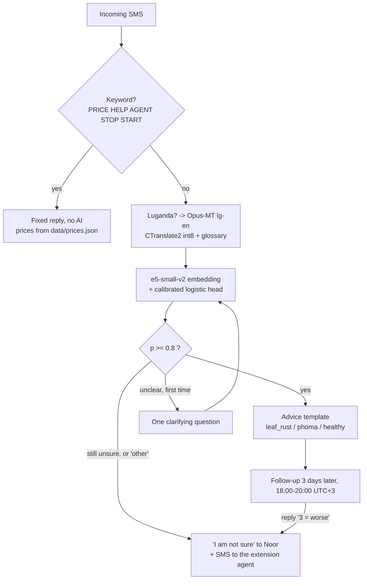

# Coffee Advisor

An SMS crop-disease advisor for smallholder coffee farmers in Uganda, built around
an 80 MB Luganda-to-English translator that runs on a CPU.

## Status

Prototype written for the Hack-Nation x World Bank challenge *Small AI for
Development* (Agriculture track), October 2026, by a team of three. **It was not
submitted in time, and it is not deployed anywhere.** What is here runs locally,
end to end, with the demo page standing in for the SMS gateway. The only artefact
published outside this repository is the translator:
[Adom4600/opus-lg-en-coffee-ct2](https://huggingface.co/Adom4600/opus-lg-en-coffee-ct2).

## The problem

Noor grows arabica on the slopes of Mount Elgon. She has a basic phone, no data
plan, and speaks Luganda. When something appears on her coffee leaves there is no
agronomist within reach, and the two diseases that matter most to her yield --
coffee leaf rust and brown eye spot (phoma) -- look alike to an untrained eye but
need different responses. A smartphone app, a camera, or an agronomist on call are
all out of scope for her. SMS is not.

## How it works

Noor texts freely, in Luganda or English. The message is translated, classified,
and answered with a **fixed template**: no generated text is ever sent to a farmer.
When the system is not sure, a human is.



Three exchanges, copied from a local run (templates are in `data/templates.json`):

**A clear symptom, in Luganda**

> **Noor** — Ebikoola by'emmwanyi zange birina obuwunga bwa kacungwa wansi
> **Advisor** — Kirabika kukwata kwa kutalagga ku bikoola (leaf rust). Noga ebikoola ebyonoonese obiziike, sala amatabi, koola, teekamu nakavundira. Buuza omulimisa.

**An unclear symptom: exactly one question, then an answer**

> **Noor** — there are spots on my coffee leaves
> **Advisor** — Please tell me more: which part of the coffee plant is affected, and what do you see on it?
> **Noor** — they have orange powder underneath
> **Advisor** — Looks like coffee leaf rust. Pick off badly hit leaves and bury them, prune and weed for air, add manure. Ask your agent about a copper spray.

**The follow-up, three days later**

> **Advisor** — How are your coffee plants 3 days on? Reply 1 better, 2 same, 3 worse.
> **Noor** — 3
> **Advisor** — Sorry to hear that. A field agent has been alerted and will call you.
>
> *(and to the agent: `+256799444555 needs a human. follow-up: getting worse`, with the original message and its English translation)*

Replies follow the language of Noor's last message. The Luganda templates are
hand-written and carry `lg_verified: false`: **no native speaker has reviewed them yet.**

## Small AI

Measured on this machine (Apple Silicon, CPU only) on 2026-10-05, with
`python scripts/eval_translate.py -n 50` and `GET /health`:

| | on disk | load | per SMS |
|---|---|---|---|
| Translator (Opus-MT lg-en, CTranslate2 int8) | 81 MB | 2.6 s | 105 ms median, 146 ms worst |
| Classifier head (`model/classifier.npz`, numpy) | 8 KB | instant | included below |
| Embedder (e5-small-v2, 33M params) | 257 MB as downloaded, several weight formats | — | — |

Resident memory for the whole chain once warm: **659 MB** (translator + embedder +
CPU torch). The translator alone peaks at 543 MB in the evaluation process, which
is why it, and not the embedder, is the part that could fit a 512 MB instance.

End-to-end accuracy -- Luganda in, label out -- is **85.7% on the 84 held-out
pairs** (leaf_rust 92%, phoma 81%, other 86%) and **78% on `data/eval/hard_test.csv`**.
Those figures and their caveats are in [`docs/datasheet.md`](docs/datasheet.md).

## The translator

`Helsinki-NLP/opus-mt-lg-en` (MarianMT, ~77M parameters, Apache-2.0) is weak on
everyday and agricultural Luganda: its OPUS training data is largely religious
text. It was fine-tuned on:

- **SALT** ([`Sunbird/salt`](https://huggingface.co/datasets/Sunbird/salt), config
  `text-all`, CC BY-SA 4.0): 23,947 training pairs, 496 dev, 500 test
  (`lug_text` -> `eng_source_text`).
- **Synthetic agricultural SMS**: English SMS generated with Claude
  (`scripts/gen_sms_en.py`, 8 weighted topics, <= 150 characters, never naming a
  disease), back-translated to Luganda through the Sunbird API. 264 training pairs
  (repeated x3) and 50 test pairs. **These are synthetic, not real farmer messages.**

Training: Colab T4, 5 epochs, lr 5e-5, batch 32, 100 warmup steps, fp16, best
checkpoint on dev loss ([`finetune_lg_en.py`](finetune_lg_en.py); the run itself
happened outside this repository). Exported to CTranslate2 int8: ~300 MB becomes
~80 MB and needs no torch at inference.

Base model against fine-tune, fp16, beam 2, on held-out sets:

| test set | chrF before -> after | BLEU before -> after |
|---|---|---|
| SALT test (500 sentences, general) | 34.0 -> **46.7** | 12.3 -> **24.9** |
| Agricultural SMS (50 sentences) | 25.2 -> **60.1** | 5.3 -> **43.6** |

Read these carefully:

- The SMS row is **optimistic**. Its Luganda comes from the same API used to build
  the training set, and the English SMS are Claude-generated and resemble one
  another. **The trustworthy number is the +12.7 chrF on SALT.**
- Synthetic Luganda is cleaner than real SMS: no typos, no abbreviations, no
  code-switching with English.
- Scores were computed on the fp16 model with beam 2, **before** the int8
  conversion. They were never recomputed after it.
- No native speaker has evaluated the output.
- `data/synthetic/domain_pairs.jsonl` is **not** a held-out test set: 230 of its
  314 lines are training rows. `scripts/eval_translate.py` scores against it for
  smoke-testing (chrF 69.5 today), and that number means nothing as an evaluation.
- `eng_source_text` and `eng_target_text` both exist in SALT; the choice between
  them was never argued.

Reproduce: `python scripts/eval_translate.py` (needs `sacrebleu`, a dev dependency
on purpose -- the server never scores anything).

## Design decisions

**SMS, not an app.** The user we designed for has a feature phone and no data plan.
Everything else follows from that: 160 characters, no images, no UI.

**No computer vision.** Rust and phoma are visually distinguishable, and there is a
public Mendeley dataset of Ugandan coffee leaves -- but Noor has no usable camera
and no way to send a photo. We used the leaf images only to generate text
descriptions for training data, never as a runtime input.

**Fixed templates, never generated text.** The models choose a template id; the
wording was written once and can be reviewed by an agronomist. A wrong template is
a known, bounded failure. A hallucinated spraying instruction is not.

**A human in the loop, as a hard requirement.** `other`, an unresolved ambiguity,
or "worse" at the follow-up pages the extension agent by SMS, with the original
Luganda and its English translation.

**Opus-MT fine-tuned, not NLLB-200-600M.** NLLB was the first choice and is still
visible in the git history. It weighed ~600 MB even in int8, was poor on
agricultural Luganda (it rendered "my coffee is fine" as "my oil is good"), and its
licence is non-commercial. The 80 MB fine-tune replaced it.

**No LLM in production.** A ~3 GB local LLM was tried as a second opinion on the
classifier's label. It did not fit the memory budget we were aiming for, it
contradicts the "Small AI" premise, and its benefit was never measured. It is still
wired in behind `USE_LLM`, and is on the list to move out of the execution path.

## Run locally

Python 3.10+ (3.12 recommended). The commands use
[`uv`](https://docs.astral.sh/uv/); `python -m venv` and `pip` work the same way.

```bash
git clone https://github.com/Plasmow/WorldBankAgriculture.git
cd WorldBankAgriculture
uv venv --python 3.12
uv pip install -r requirements-ai.txt      # full chain; requirements.txt alone = translator only
uv run python scripts/fetch_models.py      # translator (~80 MB) + e5-small-v2
cp .env.example .env                       # DEMO_MODE=1 keeps every SMS off the gateway
uv run uvicorn app.main:app --reload
```

Model weights are never committed. The first boot downloads them and reads them in
a background thread: `/health` answers immediately and reports `"loading": true`
until the chain is in (5.3 s from warm disk here).

Then open `http://localhost:8000/demo` -- a phone simulator, the agent's view, and a
clock you can move. Or walk the whole journey from a terminal:

```bash
P=+256799123456
send() { curl -s -XPOST localhost:8000/api/demo/send \
         -H 'content-type: application/json' -d "{\"phone\":\"$P\",\"text\":\"$1\"}"; }

send "Ebikoola by'emmwanyi zange birina obuwunga bwa kacungwa wansi"  # 1. Luganda symptom -> leaf rust advice
send "there are spots on my coffee leaves"                            # 2. unclear -> one question
send "they have orange powder underneath"                             # 3. answered -> advice
curl -s -XPOST localhost:8000/api/demo/clock -H 'content-type: application/json' \
     -d "{\"phone\":\"$P\",\"day\":3,\"slot\":\"evening\"}"            # 4. day 3, evening -> follow-up goes out
send "3"                                                              # 5. worse -> the agent is paged
send "PRICE"                                                          # 6. UCDA prices, no AI
curl -s "localhost:8000/api/demo/state?phone=$P"                      # the whole transcript + agent alerts
```

Numbers starting `+256799` are demo numbers: their clock is simulated and nothing
addressed to them ever reaches Africa's Talking. The `/api/demo/*` endpoints refuse
every other number.

Tests, with every model stubbed, run in seconds and need no network:

```bash
uv run pytest -q                                          # 233 passed, 14 skipped
RUN_MODEL_TESTS=1 uv run pytest -q tests/test_models.py    # the real models, ~1 min
```

## Repository layout

```
app/        FastAPI backend: /sms and /ussd webhooks, router, SQLite, scheduler, demo API
ai/         the chain: language id, translation + glossary, classifier, LLM second opinion
data/       reply templates (en, lg), UCDA prices, synthetic training data, embeddings
model/      the classifier head (numpy) and its labels/threshold; weights are gitignored
scripts/    data generation, training, evaluation, model download
web/        the demo page: phone simulator and agent view, served at /demo
docs/       datasheet for the data and the models, UCDA price reports
deploy/     Render blueprint notes, systemd unit, Caddyfile -- written, never used
tests/      pytest suite, models stubbed
```

Environment variables are documented in `.env.example`.

## Costs

An order of magnitude, **not a quote** -- re-check against Africa's Talking current
pricing before trusting it: about 35 UGX per SMS sent and 65 UGX per SMS received on
a shared shortcode. At a few exchanges per season that is roughly **1 USD per farmer
per year**, which is the number that would decide whether a cooperative could run this.

## Limitations and next steps

- No real farmer SMS have ever reached this system; every message it was built and
  measured on is synthetic or hand-written.
- No native Luganda speaker has reviewed the templates (`lg_verified: false`) or the
  translator's output.
- The published scores are the fp16 model; the int8 conversion that actually runs
  in production was never re-scored.
- The classifier knows four labels. Everything else is `other`, which means a human.
- Next: a pilot with a cooperative, native-speaker review, evaluation on real
  messages, and USSD for farmers who find SMS costly.

## Data, licences, credits

| | |
|---|---|
| [SALT](https://huggingface.co/datasets/Sunbird/salt) | Sunbird AI, CC BY-SA 4.0 |
| [`Helsinki-NLP/opus-mt-lg-en`](https://huggingface.co/Helsinki-NLP/opus-mt-lg-en) | Helsinki-NLP, Apache-2.0 |
| [`Adom4600/opus-lg-en-coffee-ct2`](https://huggingface.co/Adom4600/opus-lg-en-coffee-ct2) | this project, CC BY-SA 4.0 (inherited from SALT) |
| [Coffee leaf disease images](https://data.mendeley.com/datasets/k36wnd6knb/1) | Chelangat, Anirwoth, Mayanja, Sserwadda (2025), Mendeley Data V1, CC BY 4.0 -- used only to generate text descriptions |
| [`intfloat/e5-small-v2`](https://huggingface.co/intfloat/e5-small-v2) | MIT |
| Coffee prices | UCDA indicative farm-gate prices, see `docs/` |
| Synthetic SMS | generated with Claude, `scripts/gen_sms_en.py` |

Code in this repository is MIT-licensed, see [LICENSE](LICENSE).

## Team

Adam, Ilias and Ela, one weekend, across three areas: data and classifier,
backend and SMS gateway, AI chain and front end.
